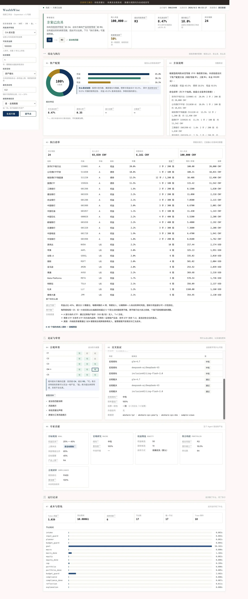

<div align="center">

# WealthWise

**个人资产配置投顾多智能体** — LangGraph 上的 Supervisor + 5 专家小组 · 中国投资者适当性护栏（C1–C5）· A/港/美股覆盖 · 双重交叉验证（多源共识 + 多模型陪审）· 三层护栏 · Langfuse 全链路 trace · SSE 工作台 · 可复现评测门禁

[](#许可)
[](https://www.python.org/)
[](https://fastapi.tiangolo.com/)
[](https://langchain-ai.github.io/langgraph/)
[](https://langfuse.com/)
[](.github/workflows/ci.yml)
[-brightgreen.svg)](#评测)
[](#评测)
[](#评测)

「武道AI / AI Engineering Dojo」**以阵制胜** 系列 · 阵 03 · 个人投顾多智能体闭环

**中文** · [English](README.en.md)

</div>

---

> **教育演示声明**
>
> WealthWise 是为「武道AI 阵03」实战案例系列构建的**教育演示项目**。它**不构成投资建议**、**不是真实合规系统**、**不适用于任何真实投顾决策**。其中的投资者适当性规则、风险等级映射与合规语料均为**合成/改写**内容，不代表中国证监会、中国证券投资基金业协会或任何监管机构的实际要求。组合优化器的单标的波动率虽已取自真实日 K，跨资产相关性仍是一个保守常数，不是真实协方差矩阵；五因子权重虽已回测（结论是**不达标、默认不启用**，见 [`docs/factor-backtest.md`](docs/factor-backtest.md)），也远谈不上一套可投产的量化策略。请勿用本软件做任何真实理财决策。

---

WealthWise 是一条个人资产配置投顾流水线。给它一份投资者画像（风险等级 C1–C5、目标、期限、是否接受跨境），它会经过一条 Supervisor + 5 专家的 LangGraph 流水线，产出一份带适当性裁决与完整披露的资产配置方案。默认运行时**完全离线、确定性**——无需 key、无需网络。设 `USE_REAL_PROVIDERS=true` 即接入 GLM + DeepSeek-V3 陪审、腾讯+新浪双源实时行情与 AkShare 宏观/汇率。

<details>
<summary><b>📸 投顾工作台的一次完整出具（C4 · 10 万 · 1 年）—— 点击展开长截图</b></summary>
<br>
<p align="center">
  
</p>
<p align="center"><sub>从资产配置与 24 行执行清单，到适当性矩阵、三模型交叉验证、五个专家各自的产出，最后是这次跑了多少 token、每个节点花了多久。</sub></p>
</details>

## 架构

```text
InvestorProfile 投资者画像
      │
      ▼
intake（归一化 / 校验）
      │
      ▼
input_guard ── 注入 / PII 筛查 → GUARDRAIL_BLOCKED
      │
      ▼
planner ── goal_constraints：期限分档、外币敞口上限、R 级上限
      │
      ▼
budget_macro ── 估算陪审调用数；超预算 → BUDGET_EXCEEDED → END
      │
      ▼
macro ── RAG 宏观上下文（CPI/PMI/利率）+ 多模型陪审出大类 tilt
      │
      ▼
equity ── 筛选权益候选（A/港/美股，R 级过滤，跨境门）
      │
      ▼
cap ── 进程护栏：去重 + 候选截断
      │
      ▼
portfolio ── 反波动率 / 风险预算优化器                    ◄──────┐
      │                                                        │
      ▼                                                 DOWNGRADE + 单次重试
budget_compliance ── 估算陪审调用数；超预算 → BUDGET_EXCEEDED → END
      │
      ▼
compliance ── 适当性检查 + 多模型陪审（GLM × DeepSeek-V3，陪审只能加严）
      │
      ▼
reflection ── PASS → explanation
              DOWNGRADE（预算允许）→ portfolio（至多一次重试）
              DOWNGRADE（已耗尽）/ REJECT → finalize
      │
      ▼
explanation ── 从结构化披露组装人读方案文本
      │
      ▼
output_guard ── 校验披露完整性（适当性 / 风险 / 免责 / 跨境汇率）
      │
      ▼
DONE   （返回完整 trace；开启后同步 Langfuse）
```

**五个专家 Agent**（每个是 LangGraph 里的一个节点）：

| 专家 | 职责 |
| --- | --- |
| 目标规划 Goal | 把投资者目标与期限解析成 `goal_constraints`（R 级上限、外币敞口上限、流动性下限） |
| 宏观 Macro | 经 RAG 检索宏观上下文（CPI/PMI/利率片段），交陪审出大类资产 tilt |
| 权益 Equity | 按 R 级适配在 A/港/美股筛选权益与固收候选（不接受跨境则仅 A 股）；候选排序两档可切——默认「规模优先」，`ENABLE_FACTOR_SCORING=true` 切到**五因子截面打分** |
| 风险组合 Portfolio | **两级**风险预算优化器：先按目标定大类中枢（`min_equity`/`max_equity`/`liquidity_min`），再在类内做反波动率（含波动下限与单一标的占比上限）；产出 `PortfolioAllocation` |
| 合规 Compliance | 中国 C1–C5 适当性检查 + 多模型陪审（GLM 主 + DeepSeek-V3 副）；产出 PASS / DOWNGRADE / REJECT，**陪审只能加严、永不软化 REJECT** |

**双重交叉验证：**

- *多源共识*（支柱一）—— **行情与宏观两条线都跑真实双源**，两边的数取中位数，对不上就记下是谁跟谁对不上，单源读数置信封顶 0.5（一个源无法自证）。
  - *行情*：腾讯 `qt.gtimg.cn`（主源，由它决定筛哪些标的、按什么条件筛）+ 新浪 `hq.sinajs.cn`（佐证源），逐个标的、逐个指标对账 price / market_cap / pe / pb。**价格容差 2%、估值容差 15%**——两个源报同一个交易所的价格本该差不到一个跳动单位，而市盈率口径（滚动窗口、股本基准日）本来就会差，两者用同一把尺子量，久而久之谁都不看告警了。价格分歧的标的**不进订单清单**（`DROP_ON_DATA_DISAGREEMENT`），但一定打标进 trace——「今天有几个标的对不上」这个数，是发现某个源开始报错价的唯一途径。停牌源报出的 `0.00` 直接不参与中位数：0 和 1299 的中位数是 649，那不是分歧，是一个编出来的价格，还标着满分置信度。
  - *宏观*：AkShare `macro_china_lpr`（基准利率，**单发布方 → 置信 0.5**）+ `macro_china_cpi_yearly`（聚合口径）与 `macro_china_cpi`（统计局口径）两家**互相独立的 CPI 发布方**，经 `SourceRegistry` 真对账。没有为利率硬凑第二个源：Shibor 与 LPR 量的不是一回事，取中位数会产出一个没人发布、也没人按它借钱的数字。三个源都带**新鲜度门禁**：超过 100 天没出新数就什么都不报。这一条不是防御性编程——聚合口径那家现在正停更在 2025-08，而共识层恰恰最看不出这种故障：一个 2025 年 8 月的 0.0% 和一个 2026 年 7 月的 0.5% 都像正常的 CPI 读数，对账完只会给出一个「分歧很小、置信很高」、却不描述任何一个月份的数字。挡掉之后 CPI 退回单发布方、置信 0.5，写在共识记录里，看得见。定性视图（大类观点/风险情绪）来自样例快照，但**只提供这些定性判断，不参与任何数值对账**——一个静态 JSON 文件不该给实时读数背书。
  - 离线模式同样走这一层（单源、置信 0.5），所以测试与评测跑的是生产的同一条路径，而不是一条绕开共识层的旁路。
- *多模型陪审*（支柱二）—— 合规与宏观判定交给**跨三家实验室的奇数陪审团**（GLM-4.7 智谱 / DeepSeek-V3 / Ling-flash-2.0 蚂蚁）；多数标签胜出（3/3=1.0、2/3≈0.667、三方分歧无多数记 `None`），低置信升级人工复核。奇数才有「多数」可言——两个模型只有「一致」与「平票」两种结果。**PASS 也要复核**：确定性规则只会错在「本该拦却放行」这一侧，所以 PASS 结果按 `jury_review_pass_rate` 抽样复检（默认全查），陪审依旧只能加严。

**三层护栏：**

1. *输入* —— 画像文本归一化 + 注入分类（角色劫持 / 指令改写 / 零宽走私）→ `GUARDRAIL_BLOCKED`。
2. *过程* —— 候选去重、R 级上限强制、外币敞口上限。
3. *输出* —— 披露完整性校验；持有港/美股时强制含**跨境汇率**风险披露（校验实质「汇率」措辞，而非关键词凑数）。

## 技术栈

| 关注点 | 选择 |
| --- | --- |
| API / 编排 | FastAPI · LangGraph |
| 主模型 | **GLM-4.7**（z.ai，OpenAI 兼容） |
| 交叉验证模型 | **DeepSeek-V3** + **Ling-flash-2.0**（均走 SiliconFlow）—— 与 GLM 合成跨三家实验室的奇数陪审团 |
| 真实行情 | **腾讯 qt.gtimg.cn**（主源：报价/市盈/市净/市值/换手）+ **新浪 hq.sinajs.cn**（佐证源）双源共识 |
| 真实历史 | **腾讯日 K**（`web.ifzq.gtimg.cn`）—— 60 日动量与已实现波动，并发抓取（实测 20 标的 0.4s / 8 并发） |
| 真实宏观 | **AkShare**（LPR + 两家 CPI 发布方，列名与新鲜度均已对着实时输出校准）|
| 真实汇率 | **AkShare 中行折算价**（`currency_boc_sina`，按 100 单位换算，超过 10 天不新鲜直接报错而不返回旧价）|
| 离线运行时 | 样例 Provider + 本地哈希嵌入 + 内存向量库 + 离线陪审（零 key、零网络） |
| 工作台前端 | 单文件静态页，**零外部依赖**：图表是手写 SVG，字体走系统栈。此前图表库走 CDN，离线模式下那块画布是空的——而那正是读者第一眼看的地方 |
| RAG | 内存余弦向量库 + 本地哈希嵌入；检索宏观上下文与合规/研报语料 |
| 可观测 | **Langfuse** v4（可选）+ 每次响应返回内部 trace 树 |
| 评测 / CI | pytest + 多套件硬门 CLI + GitHub Actions |
| 持久化 | run/审计：内存默认 · sqlite（`RUN_STORE=sqlite`）· **Postgres**（`RUN_STORE=postgres` + `RUN_STORE_DSN`，psycopg 3） |
| 部署 | Dockerfile + docker-compose（离线即跑） |

## 快速开始

**前置要求：** Python 3.12+。默认运行时**完全离线、确定性**——无需任何 key。

```bash
# 1. 克隆并建虚拟环境
git clone <repo-url> wealthwise && cd wealthwise
python3 -m venv .venv

# 2. 安装（base + LLM extras；data extra 额外装 AkShare）
.venv/bin/pip install -e '.[dev,llm]'

# 3. 跑测试（离线、hermetic）
make test           # → 520 passed

# 4. 跑评测门禁（离线、硬门）
make eval           # → 64/64（离线模式），适当性漏判 0，配置合理性 100%，注入拦截 100%

# 5. 启动工作台
make run            # uvicorn wealthwise.app:app --reload
```

浏览器打开 <http://localhost:8000/workbench>，提交一份投资者画像。

**切换到真实 Provider（keyed 路径）：**

```bash
cp .env.example .env
# 填入 GLM_API_KEY、SILICONFLOW_API_KEY，以及可选的 LANGFUSE_* keys
# 设 USE_REAL_PROVIDERS=true

make run   # 此时使用 GLM + DeepSeek-V3 陪审 + 腾讯/新浪行情 + AkShare 宏观
```

完整的 keyed 路径验证指南（含 AkShare 列名与新鲜度校准记录）见 [`docs/real-data-verification.md`](docs/real-data-verification.md)。

**Docker（离线，无需 key）：**

```bash
docker compose up        # 构建镜像，启动在 :8000
# 打开 http://localhost:8000/workbench
```

**Langfuse 连通性自检（仅 keyed 路径）：**

```bash
make langfuse-check
# → sent wealthwise.langfuse_smoke: wealthwise
# 无 key 时 → 打印 "tracing disabled / no keys — skipping" 并 exit 0
```

## 用法示例

```bash
# 完整投顾运行（JSON 响应）
curl -X POST localhost:8000/workbench/run \
  -H 'Content-Type: application/json' \
  -d '{
    "risk_level": "C3",
    "investable": 500000,
    "horizon_years": 5,
    "goals": ["balanced_growth"],
    "liquidity_min": 0.2,
    "accept_cross_border": true,
    "holdings": []
  }'
```

```jsonc
{
  "summary": {
    "status": "done",
    "portfolio_r_level": "R3",
    "compliance_decision": "PASS",
    "fx_exposure": 0.15,
    "budget_spent": 4
  },
  "portfolio": {
    "weights": { "600519.SH": 0.30, "2800.HK": 0.15, "000001.SH": 0.35, "CASH": 0.20 },
    "class_weights": { "equity": 0.65, "cash": 0.20, "bond": 0.15 }
  },
  "compliance": {
    "decision": "PASS",
    "disclosures": ["跨境汇率风险：持仓含港股/美股，存在汇率波动、通道与税收风险。", "..."],
    "confidence": 0.9
  },
  "trace": [
    { "node": "intake", "status": "ok" },
    { "node": "macro", "status": "ok", "macro_label": "neutral" },
    "..."
  ]
}
```

```bash
# 逐节点 SSE 流式
curl -N 'localhost:8000/workbench/stream?risk_level=C3&investable=500000&horizon_years=5&goals=balanced_growth&liquidity_min=0.2&accept_cross_border=true'
```

对 `goals` 或画像文本字段的注入攻击会命中输入护栏，立即返回 `status: GUARDRAIL_BLOCKED`。

## 评测

```bash
make eval   # = python -m wealthwise.eval  （全部 6 套件）
```

**7 套件 / 64 例**（完全离线、hermetic）：

> 这套门禁跑在离线桩陪审上：它度量的是**规则与流水线**是否自洽，不是模型判断力。真模型的表现要用 keyed 真实验证单独跑（见 `docs/real-data-verification.md`）。

| 套件 | 覆盖 |
| --- | --- |
| `golden` | 端到端流水线：C1–C5 各档 happy path、是否接受跨境、决策与组合风险等级对齐标注 |
| `suitability` | 适当性函数直测：越级违规、流动性击穿、未授权跨境 —— 硬门：0 漏判 |
| `misleading` | 误导用语检测：保本 / 稳赚 / 承诺收益必须 100% 拦截；带免责的正常文案不得误报 |
| `cross_border` | 跨境披露完整性 + 未授权持仓门：持港/美股必须含实质汇率披露 |
| `robustness` | 注入拦截率、画像变形不变性（格式变体不得改变决策）、良性边界误报率 |
| `status_routing` | 端到端状态路由：注入越级/跨境/去流动性，验证 DOWNGRADE→需复核、REJECT→不可出具 |
| `allocation_sanity` | **配置合理性（硬门）**：权益上下限、流动性下限真达成、单一持仓上限、持仓数上限 —— 适当性的另一侧：方案不能「安全到答非所问」 |

**最新基线：**

| 指标 | 值 | 门禁 |
| --- | --- | --- |
| total_cases | **64** | >= 30 |
| pass_rate | **1.000** | 1.0 |
| decision_accuracy | **1.000** | >= 0.8 |
| **suitability_leaks** | **0** | = 0（exit 2） |
| misleading_block_rate | **1.000** | = 1.0（exit 2） |
| **cross_border_leaks** | **0** | = 0（exit 2） |
| injection_block_rate | **1.000** | >= 1.0（exit 2） |
| invariance_pass_rate | **1.000** | >= 1.0（exit 2） |
| false_positive_rate | **0.000** | = 0.0（exit 2） |
| **status_routing_accuracy** | **1.000** | >= 1.0（exit 2） |
| **allocation_sanity_rate** | **1.000** | >= 1.0（exit 2） |
| **门禁** | | **PASS** |

> 评测套件位于 [`data/evals/`](data/evals/)。每次运行生成报告 [`data/evals/report.md`](data/evals/report.md)。

## 可观测

每次投顾运行都返回一个 `trace` 节点事件列表（`node`、`status`、`budget_spent` 等）。配置 Langfuse 后，同一批边界会作为外部 observation 发出：

```
intake → input_guard → planner → budget_macro → macro → equity
  → cap → portfolio → budget_compliance → compliance → reflection
  → explanation → output_guard
```

测试通过 conftest 的 autouse fixture 强制关闭 tracing，保证测试套件 hermetic、绝不误发到线上 Langfuse 项目。

## 配置

`.env`（见 [`.env.example`](.env.example)）关键字段：

| 变量 | 说明 |
| --- | --- |
| `USE_REAL_PROVIDERS` | `true` 启用真实数据（腾讯+新浪双源行情 / AkShare 宏观 / 腾讯日 K）+ 真实 LLM 陪审（默认 `false`） |
| `ENABLE_FACTOR_SCORING` | `true` 切到五因子截面打分选股（默认 `false`，见下节「多因子打分」） |
| `DROP_ON_DATA_DISAGREEMENT` | 两源报价分歧超容差时是否把标的排除出选股（默认 `true`；关掉也仍打标进 trace） |
| `GLM_API_KEY` / `GLM_BASE_URL` | 主模型（GLM-4.7，z.ai OpenAI 兼容网关） |
| `SILICONFLOW_API_KEY` | 交叉验证陪审模型 key（SiliconFlow） |
| `CROSSCHECK_MODEL` | 第二陪审员（默认 `deepseek-ai/DeepSeek-V3`） |
| `THIRD_MODEL` | 第三陪审员（默认 `inclusionAI/Ling-flash-2.0`，走 SiliconFlow，凑成奇数陪审团）；设空串回退两模型档 |
| `ENABLE_LANGFUSE_TRACING` | `true` 向 Langfuse 发送 trace |
| `LANGFUSE_PUBLIC_KEY` / `LANGFUSE_SECRET_KEY` | Langfuse 项目凭证 |
| `LANGFUSE_BASE_URL` | Langfuse 端点（默认 `https://us.cloud.langfuse.com`） |
| `MAX_FX_EXPOSURE` | 组合非 CNY 资产最大占比（默认 `0.5`） |
| `MAX_LLM_JUDGMENTS` | 单次运行 LLM 调用硬预算上限（默认 `12`）。预算估算按**实际陪审员数**推算（一次合议 = 每位陪审员一次调用），三名陪审员的一次完整咨询实测占用 6/12，留有余量 |
| `RISK_BUDGET_METHOD` | 组合优化方法：`risk_parity`（默认；其他方法预留，未实现即 `NotImplementedError`） |
| `RUN_STORE` | 审计持久化：`memory`（默认）· `sqlite`（单进程）· `postgres`（多进程） |
| `RUN_STORE_DSN` | libpq 连接串，`RUN_STORE=postgres` 时必填（另需 `pip install -e '.[pg]'`）；**故意没有默认值**，免得配错的部署照常启动、把审计写到没人看的地方 |
| `TOKEN_PRICE_PER_1K` | 成本核算用的混合 $/1k tokens 单价 |

## 多因子打分

`ENABLE_FACTOR_SCORING=true` 时，权益候选的排序从「市值大的排前面、市值相同就看谁便宜」换成五因子截面复合分。

| 因子 | 输入 | 方向与理由 |
| --- | --- | --- |
| 价值 value | 由 P/E 得 E/P、由 P/B 得 B/P，取二者均值 | 便宜更好。**用收益率而非比率**：P/E 上不封顶且过零点不连续，一个 900 倍的市盈率能靠自己决定整个市场的排名；E/P 有界，亏损公司自然落到负数，那正是它该得的名次 |
| 动量 momentum | 60 个交易日收益，**跳过最近 5 日** | 涨势会延续（动量效应）。跳过最近 5 日不是修饰：不跳的话因子被短期反转主导，最后买的是刚暴涨的、卖的是刚回调的，跟它名字的意思正好相反 |
| 低波 low_vol | 已实现波动率（日对数收益年化） | 越低越好（学术上叫「低波动异象」：波动小的股票长期反而不吃亏），也是五个因子里跟适当性目标最对齐的一个 |
| 规模 size | log10(市值) | **越大越好——故意反着学术上的小盘溢价用**。这本组合服务的是适当性与流动性，不是最大化预期收益；不该把微盘股的风险溢价塞给一个 C2 投资者 |
| 流动性 liquidity | 换手率，**封顶 5%** | 可交易性。封顶而非单调：过了每天几个百分点，多出来的换手是投机不是流动性，单调的话每次排第一的都是当天最热的票 |

**怎么算**：每个因子在**单一市场内**做截面 z-score（±3σ 裁剪）后加权。按市场分开不是细节——A 股、港股、美股处在不同的估值体系里，混在一起 z-score 等于拿市场跟市场比排名，而那件事 `_MARKET_QUOTA` 的地域配额已经在明面上做了。

**缺数据不扣分**：某个因子没数的标的，把它从**自己**的复合分里剔掉、按剩下的因子重新归一，所以一个 3/5 覆盖的标的跟 5/5 的在同一把尺子上比。反过来做（把沉默当作差评）会系统性地压低那些佐证源覆盖较薄的标的，把一个数据覆盖的假象包装成对公司的判断。

**动量与波动从哪来**：`providers/history.py` 拉腾讯日 K（每标的一次请求，`;` 批量形式被服务端拒绝，实测 8 并发下 20 标的 0.4s）。只对**过了风险上限、还在竞争名额**的标的拉，不对整个筛选结果拉。

顺带补上的一个缺口：`optimize.py` 按类内反波动率加权，缺 `volatility` 时回落到 `DEFAULT_VOL = 0.15`——而此前**没有任何真实 Provider 提供这个字段**，所以每次真实运行都在把货币基金和小盘股当作同样的风险，反波动率加权其实是等权的一种复杂写法。现在已实现波动率是真的（实测区间 0.18–1.05）。

**它值不值得默认打开：不值得。** `scripts/backtest_factors.py` 拿这 872 只候选、800 根日 K、34 期月度调仓量过一遍（[`docs/factor-backtest.md`](docs/factor-backtest.md)）：在它真正要替换的那条路径上，五因子打分比现有的规模规则**每月少 4 个基点，t = −0.09**。所以 `ENABLE_FACTOR_SCORING` 依然默认关闭——只是理由从「没测过」换成了「测了，没赢」。

最值得记的一条读数：组合打分在全部 872 只上的 rank IC 是 +0.059、t = 2.38，看着挺像回事；过完市值下限、再按 60/20/20 配额切到前 50 只，优势就归零了。**排序能力集中在中后段，而那一段本来就被适当性门槛挡在外面。**

## 项目结构

```text
wealthwise/
├── README.md / README.en.md    # 中文（默认）/ English
├── pyproject.toml              # 依赖 + wealthwise-eval / -langfuse-check 入口
├── Makefile                    # make install / test / test-pg / eval / backtest / run
├── Dockerfile                  # python:3.12-slim，离线即跑
├── docker-compose.yml          # compose 服务 + 可选 Postgres（RUN_STORE=postgres）
├── .env.example
├── scripts/
│   ├── verify_real.py          # keyed 真实数据验证脚本
│   ├── refresh_universe.py     # 重新生成 data/universe.json
│   └── backtest_factors.py     # 五因子权重回测（34 期月度调仓）
├── docs/
│   ├── real-data-verification.md  # keyed 路径验证 + AkShare 校准记录
│   └── factor-backtest.md         # 五因子回测口径、读数与结论
├── data/
│   ├── samples/                # 离线 Provider 语料
│   │   ├── equities.json       # A/港/美股权益候选
│   │   ├── funds.json          # 基金 / 固收 / 货币候选
│   │   ├── macro.json          # 宏观上下文（CPI/PMI/利率）
│   │   ├── fx.json             # 汇率
│   │   ├── policy.json         # 适当性/风险揭示政策语料（RAG）
│   │   └── research.json       # 标的研报/资讯语料（RAG）
│   └── evals/                  # 7 套件 / 64 例
│       ├── golden.json  suitability.json  misleading.json
│       ├── cross_border.json  robustness.json  status_routing.json
│       └── report.md
├── src/wealthwise/
│   ├── app.py                  # FastAPI：/health · /workbench(page/run/stream) · /runs
│   ├── bootstrap.py            # build_sample_deps / build_runtime_deps + 离线陪审
│   ├── config.py               # pydantic-settings（全部环境变量）
│   ├── crosscheck/             # 多模型陪审：deliberate()、离线 stub
│   ├── eval.py                 # 多套件硬门 CLI
│   ├── langfuse_check.py       # Langfuse 连通性自检（离线安全）
│   ├── llm.py                  # Verdict / ModelClient / OpenAI 兼容客户端
│   ├── obs.py                  # Langfuse 环境桥接 + traced() 装饰器
│   ├── runner.py               # run_advisory：装依赖 + invoke 图 + 校验
│   ├── store.py                # RunStore：memory / sqlite / postgres 后端
│   ├── workbench.py            # SSE 流式 + 五块 Dashboard 聚合
│   ├── agents/
│   │   ├── state.py            # InvestorProfile / AssetCandidate / AdvisoryState / …
│   │   ├── deps.py             # AdvisoryDeps（Provider + 阈值 + 预算）
│   │   ├── experts/            # goal / macro / equity / portfolio / compliance 节点
│   │   └── supervisor/         # graph.py（LangGraph）· planner.py
│   ├── compliance/             # suitability.py（C-R 硬门）· language.py（误导用语检测）
│   ├── guardrails/             # input.py · output.py · process.py
│   ├── portfolio/              # metrics.py（纯函数）· optimize.py（风险预算）
│   ├── providers/              # tencent（主源）· sina（佐证源）· consensus_provider（共识层）· history（日K）· akshare（宏观 + 汇率）· sample · registry
│   ├── rag/                    # embed（本地哈希）· store（内存余弦）· corpus
│   └── security/               # sanitize.py（注入检测）· redact.py（PII 脱敏）
└── tests/                      # pytest（520 passed，conftest 强制隔离开发者 .env）
```

## 路线图 / 诚实的留白

已交付：

- ✅ Supervisor + 5 专家 LangGraph 流水线（目标 / 宏观 / 权益 / 风险组合 / 合规）
- ✅ 多源共识（支柱一，行情腾讯+新浪双源 / 宏观 LPR+两家 CPI）+ 多模型陪审（支柱二）
- ✅ 五因子截面打分（价值 / 动量 / 低波 / 规模 / 流动性），`.env` 开关控制，默认关闭
- ✅ **因子权重回测**（34 期月度调仓，[`docs/factor-backtest.md`](docs/factor-backtest.md)）——结论是这套打分**没赢过**现有的规模规则，所以开关保持默认关闭
- ✅ 三层护栏（输入 / 过程 / 输出）+ 预算护栏
- ✅ 中国投资者适当性（C1–C5）+ 跨境汇率规则 + 误导用语检测
- ✅ A/港/美股覆盖（样例 Provider + 腾讯/新浪双源真实行情）
- ✅ **AkShare 列名与新鲜度校准**（宏观 LPR / 两家 CPI / 中行汇率，对着实时输出逐列核过，[`docs/real-data-verification.md`](docs/real-data-verification.md)）
- ✅ RAG 宏观上下文 + 合规/研报语料（内存、本地哈希嵌入）
- ✅ Langfuse 全链路可观测（可选、离线安全）
- ✅ SSE 工作台 + 运行审计存储
- ✅ 多套件评测门禁（64 例，含端到端 status_routing 与 allocation_sanity 硬门）
- ✅ Docker + docker-compose + CI（GitHub Actions）
- ✅ 持久化（RunStore：memory + sqlite + **Postgres**，三个后端同一套 append-only 语义）

已知留白与后续工作：

- **CPI 目前只剩一个发布方** —— 聚合口径的 `macro_china_cpi_yearly` 在本 akshare 版本里**停更在 2025-08**（同一批 jin10 系列全部停在那几天），统计局口径的 `macro_china_cpi` 是新的。列名映射是对的，新鲜度门禁会把停更的那家挡掉，于是 CPI 退回单发布方、置信 0.5——诚实，但**支柱一在 CPI 这一路上暂时只剩一条腿**。需要的是一个真正独立且在更新的第二发布方，而不是在同一张表里再取一列。
- **辩论 / 层级式多智能体** —— 当前陪审是扁平多数投票；结构化辩论回环（Supervisor 调解专家分歧）是后续工作。
- **真实协方差矩阵** —— 单标的波动率已经是真的了（腾讯日 K 的已实现波动，实测区间 0.18–1.05；此前每个真实标的都在吃 `DEFAULT_VOL=0.15` 这个常数，所谓反波动率加权其实等于等权）。**相关性还不是**：优化器仍用 `ASSUMED_CROSS_CORR=0.3` 一个常数。真实均值方差 / Black-Litterman 需要完整协方差矩阵。
- **因子权重要改，得靠这次回测没见过的日期** —— 动量在三个市场的 IC 全为负，是这套权重里最站不住的 25%；但「删掉一个在本样本上表现差的因子」和「按本样本挑因子」是同一件事的两种说法。同理，行业中性化还没接：现货报价不带行业字段，实跑一次因子排序前排几乎全是银行股。
- **港股拿不到换手率** —— 腾讯报价在港股那一栏返回 0，所以流动性因子对港股整段缺失（覆盖度重归一会兜住，但那一档确实只按四个因子打分）。
- **付费数据源** —— 面向中国市场的付费量化数据（如 Wind、iFinD）未接入；免 key 源仅覆盖公开数据。

## 许可

[MIT](LICENSE) (c) 2026 Kevin Tu（WealthWise / 武道AI）
